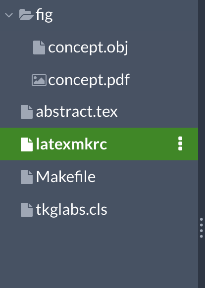
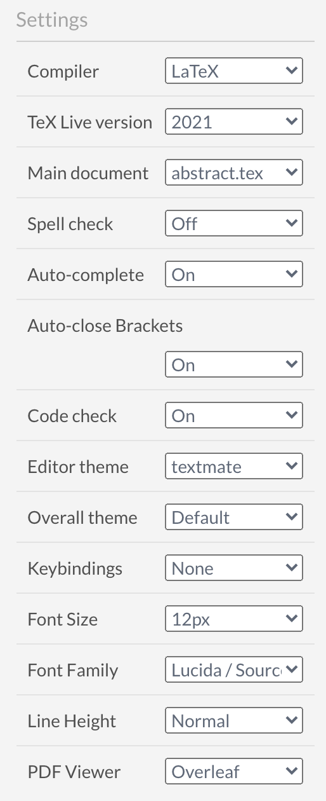
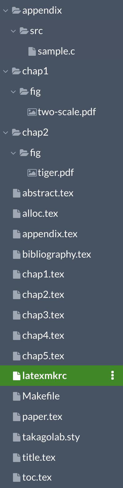
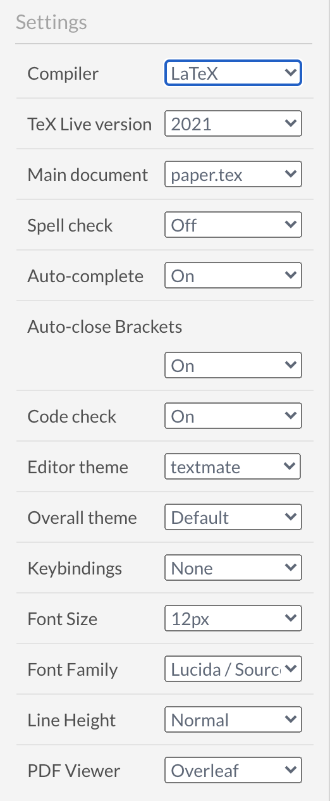

# Overleafでの使い方

## Overleafとは
[Overleaf](https://www.overleaf.com/)は，LaTeXをWebで書くためのツールになります．  
もし，環境設定や仮想環境などが困難な場合はこれを利用するのもいいと思います．  

入門の場合はこの辺を読んで見るといいかも
> [30分もいらないLaTeX入門](https://qiita.com/Go_in_lis/items/41688cdf89eab8f15f71)

## abstractを作成する

1. [Overleaf](https://www.overleaf.com/)開いてプロジェクトを作成
2. ログインしてプロジェクト一覧を開く
3. New Project > Blank Project を押して新しいプロジェクトを作成します
4. プロジェクトの編集ページが表示されたらすでにある`mian.tex`を削除します
5. このリポジトリの[abstract](/abstract)の中身を全てアップロードしてください  
(**注意:** ディレクトはアップロードできませんOverleaf上で作成してください)  
(**注意:** ディレクトリ構造が崩れるとうまく動きません注意です)
6. `latexmkrc`というファイルを作成して以下の内容を書き込みます  
```
$latex = 'uplatex';
$bibtex = 'upbibtex';
$dvipdf = 'dvipdfmx %O -o %D %S';
$makeindex = 'mendex -U %O -o %D %S';
$pdf_mode = 3;
```
7. 左端が以下のようになってれば正解  
 
8. 左端のメニューを開いて以下のように設定します  
 
9.  これで完成です！！  
あとは普通のtexエディタと同様です．

## paperを作成する

1. [Overleaf](https://www.overleaf.com/)開いてプロジェクトを作成
2. ログインしてプロジェクト一覧を開く
3. New Project > Blank Project を押して新しいプロジェクトを作成します
4. プロジェクトの編集ページが表示されたらすでにある`mian.tex`を削除します
5. このリポジトリの[abstract](/abstract)の中身を全てアップロードしてください  
(**注意:** ディレクトはアップロードできませんOverleaf上で作成してください)  
(**注意:** ディレクトリ構造が崩れるとうまく動きません注意です)
6. `latexmkrc`というファイルを作成して以下の内容を書き込みます  
```
$latex = 'uplatex';
$bibtex = 'upbibtex';
$dvipdf = 'dvipdfmx %O -o %D %S';
$makeindex = 'mendex -U %O -o %D %S';
$pdf_mode = 3;
```
7. 左端が以下のようになってれば正解  
 
8. 左端のメニューを開いて以下のように設定します  
 
9. `takagolab.sty`の50行目を  
`\usepackage{color,listings,plistings}`から  
`\usepackage{color,listings}`に変更してください
10.  これで完成です！！  
あとは普通のtexエディタと同様です．

作成者: [鈴木大志](https://github.com/SuzukiDaishi) (変更日: 2021.1.8)
